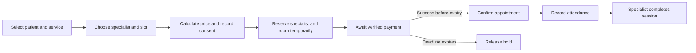

# Booking and financial workflows

Updated: 8 October 2026. Status: confirmed directions and proposed rules with unresolved business decisions.

Booking and payment form the first workflow to define and eventually implement. A correct appointment depends on patient access, service pricing, specialist availability, room capacity, consent, and payment verification.

## Distinct business concepts

| Concept | Meaning |
|---|---|
| Account | The person authenticating and using the system |
| Patient | The beneficiary receiving treatment |
| Order and order line | The service, package, or assessment purchased and its agreed price |
| Appointment | A scheduled delivery of care |
| Payment and allocation | Money received and the order or line it settles |
| Invoice and credit note | Financial documents and corrections |
| Package entitlement | A purchased right to specified sessions |
| Wallet entry | A credit, debit, refund, or adjustment in the internal wallet |

An account can book for an authorized family member. An assessment may not need an appointment, and a package covers multiple appointments. Do not make appointments the only owner of purchases and payments.

## Normal booking flow

**Confirmed checkout:** Reserve the selected appointment for seven minutes while payment is pending, show a countdown, and release the unpaid hold at expiry with «انتهى وقت الدفع، يرجى المحاولة مرة أخرى». Booking by bank transfer is not allowed. Server time and trusted provider payment state govern expiry and confirmation; the app timer is display only.

| Decision | Proposed starting rule |
|---|---|
| Availability | Service eligibility, specialist schedule, no overlapping booking or hold, and a room for in-person care |
| Price | Server-calculated, including specialist price, approved discount rules, and validated tax treatment |
| Confirmation | For online payment, provider-confirmed successful payment is required before the appointment becomes confirmed; retain separate fulfillment rules for paid package entitlements and eligible free follow-ups |
| Online payment | Confirmed seven-minute checkout hold with visible countdown; release unpaid capacity at expiry |
| Bank transfer | Not allowed for bookings; no transfer-proof booking flow |
| Late payment | **Deferred AUD-11:** preserve/reconcile trusted outcomes; no booking/refund/reallocation policy is selected for success after expiry |
| Attendance | Separate evidence from appointment completion and financial settlement |
| Completion | Treating specialist completes normally; reception may perform authorized operational closure when the doctor forgets (AUD-19), without clinical signing |

**Confirmed on 4 October 2026:** Allocate rooms per appointment. Reception selects the room; show reception suggestions of rooms available for that appointment rather than automatically assigning a room or reserving it for a practitioner's entire shift. Room allocation at confirmation is a source requirement; how reception's selection fits self-service booking and confirmation timing remains open. The proposed hold should reserve room capacity too, so payment does not succeed for an impossible in-person booking. Suggestions must respect branch scope and current reservations/holds, with availability rechecked when the selection is saved; ranking and service-specific room constraints remain open.

## Confirmed scheduling and session actions — 4 October 2026

- Reception marks an in-person patient Arrived; the treating doctor explicitly confirms the end-session process before the session is marked Finished and a rating request is sent to the patient. These separate attendance and completion events supersede patient self-recording of in-person arrival. Online join evidence remains separate. Keep payment settlement separate from both events; rating is optional and not a completion/payment condition. See [patient feedback](14-patient-session-feedback.md).
- Patients book from the doctor's scheduled free slots and see the next available appointment date/time, including when it is a week away. Waiting-room queue position and estimated wait were not selected.
- Doctors and management can control the doctor's daily session count and session time/duration. Session duration is configurable, not a fixed universal value. Five daily sessions and X minutes are illustrative, not defaults. Schedules support different working hours per weekday, breaks between sessions, and days off. Changes to session count or duration apply only to unbooked slots; existing bookings retain their booked date/time and duration. Exact duration configuration scope, break settings, and handling of days off that conflict with existing bookings remain open; do not infer automatic cancellation or rescheduling.
- The doctor presses Ready for patient to notify both reception and the patient. This trigger is confirmed; notification channels remain open and advance reminders remain separate.
- Preserve branch scope, selected search dates/filters, and salary-paid availability priority/external fallback. If there are no available appointments at all in the search results, show next-available date/time suggestions separately, including dates beyond the selected range. Do not silently widen the range or suggest unavailable/unauthorized capacity; retain matching non-date filters and existing doctor-priority rules. If results exist, do not automatically add out-of-range suggestions merely because one doctor has no slots. Exact suggestion count and search horizon remain open. Existing reservations must remain unchanged by count/duration setting edits. Proposed safeguard: prevent new slots from overlapping those reservations. Patient cancellation and modification are blocked with less than 24 hours remaining; authorized staff exceptions and other change details remain open.

## State design

The 4 October clinical clarification distinguishes patient departure/actual consultation end from later session-note writing and doctor-confirmed Finished status. Prescriptions may be written before departure. Do not require notes before the patient can leave. Exact completion validation remains open. Rating delivery is email after confirmation plus a next-app-opening popup if unanswered, within existing eligibility. The 48-hour review window starts at actual consultation end even if confirmation is delayed; reception records actual in-person end if the doctor forgets. Detailed recording/correction permissions remain open; actual end remains distinct from administrative closure. **AUD-19:** reception may perform authorized operational closure if the doctor forgets, with actor audit and separate actual-end/closure timestamps. This does not authorize reception to sign clinical reports or change feedback eligibility.

**Confirmed overrun behavior:** Measure allocated duration from actual consultation start. At expiry, show the doctor a red warning if unfinished; notify reception if it remains unfinished after a system-configured delay from expiry. Delay value/default and configuration owner remain open. The doctor can extend the active session using a period configurable by doctor or management; no numeric defaults/limits were approved. This explicit active-session extension is distinct from changing general scheduling defaults. Expiry does not complete the session or trigger no-show/rating. Preserve attended/ongoing consultation protection. No-show timing still uses scheduled start plus the separate attendance grace period. **Confirmed AUD-12:** block extension when a later booking exists for the affected doctor or room; check both resources before offering extension and protect the mutation against concurrent bookings. Never extend into another confirmed booking, move/delay the next patient or automatically reschedule. Actual-start capture, extension recalculation, exact waiting/conflict detection and financial consequences remain unresolved; no automatic booking shifts or extra charges are approved. See [customer appointments](10-customer-mobile-appointments.md).

Keep booking state, payment state, attendance, recording state, and accounting synchronization separate. Preserve the required appointment labels through mappings to stable business meanings. Administrator-created labels must not redefine billing or authorization rules implicitly.

The source lists confirmed, pending, completed, cancelled, no-show, cancelled for nonpayment, and postponed. It also mentions processing in the patient interface. Agree the canonical transitions and presentation mappings.

The automatic no-show rule must account for recorded attendance and remote sessions continuing beyond the scheduled end. **Superseded source wording:** a one-time late-change exception cannot re-enable patient changes inside the confirmed 24-hour cutoff. Authorized staff exceptions require separate decisions.

**Confirmed user refinement:** Automatic no-show assignment uses the scheduled appointment start plus an administration-configured grace period. This replaces the source's scheduled-end timing for the current design. Recorded attendance or an active consultation prevents automatic no-show even when completion has not yet been entered. A mobile countdown alone never determines attendance or a financial charge.

`No-show cutoff = scheduled start instant + applicable grace period`

The grace period is configurable rather than a hardcoded 15-minute default. No numeric value has been approved. Grace and advance-reminder lead time are separate settings. Whether the grace policy can vary by appointment mode, service, or practitioner remains open.

Proposed implementation: schedule a durable cutoff check, then atomically recheck appointment state and reconciled attendance before applying a no-show and its financial/entitlement effect. Do not classify cancelled, postponed, completed, attended, or ongoing consultations through that job. Rescheduling must invalidate stale checks and establish a new cutoff. Define handling for late attendance events, provider outages, and authorized corrections.

Use policy versions for audit and finalize whether grace-period edits affect already booked appointments or only future bookings. If existing appointments are affected, replace their cutoff checks deliberately rather than leaving stale jobs to apply old timing. The cutoff is not a hard stop for an online consultation and is separate from reconnection grace.

## Confirmed patient no-show policy

The user chose retention of the fee for patient no-shows, for both in-person and online appointments.

- For a paid standalone appointment, the center retains the session payment; it is not automatically refunded or credited to the wallet.
- For a package appointment, consume one session entitlement; do not restore it merely because the patient did not attend.
- Keep the appointment classified as No-show, not Completed. Retained fees do not count as completed-session doctor incentive or monthly target revenue.
- Consumption and any financial classification must be idempotent so a repeated no-show job cannot consume another session or charge the patient twice.
- This decision applies to patient nonattendance. Late cancellation, clinician absence, center failure, and online technical-failure adjudication need their own rules; they are not automatically patient no-shows.
- Define authorized correction and restoration behavior if a no-show was assigned incorrectly. Auditing and entitlement history must preserve the original action and its correction.

**Confirmed latest answer:** For a later package-stop refund, reprice consumed no-show sessions at the standalone/base price outside the package, just like used completed sessions. No-show still does not generate a doctor incentive or completed-session target progress.

## Changes to a booking

For every cancellation, reschedule, center postponement, specialist transfer, and no-show, define the actor, deadline, financial effect, resulting state, reason, notification, and audit event.

**Confirmed cancellation direction:** The latest user policy blocks patient cancellation or appointment modification when less than 24 hours remain before scheduled start. At exactly 24 hours, the wording permits the action; this boundary is the documented interpretation of “less than.” This supersedes the earlier unspecified administrator-configured cutoff. Before the cutoff, preserve the original-method refund or wallet choice and restoration of the reserved package session. Processing times remain open.

No late self-service cancellation/rescheduling is allowed. Staff overrides, center-initiated changes, one-time exceptions mentioned in the source, and the scope of an allowed modification still need explicit rules. Do not automatically equate an attempted blocked change with no-show or charge.

**Confirmed Motmaan/doctor cancellation:** Credit the internal Motmaan wallet. The patient now requests a bank payout inside the wallet; a system administrator or accountant approves. This supersedes the earlier contact-administration-only workflow. Only service-refund credits are withdrawable; coupon/promotional credit is not. Bank verification, execution, rejection, timing, and reconciliation remain open.

**Confirmed packages:** The patient selects the suitable practitioner and that practitioner's package. Current packages repeat sessions, rather than mixing services. Family members may use sessions from the package, and may change practitioner and pay a price difference if one exists. Administrators still control package offers, sale/expiry, and settings. Future treatment pathways involving different practitioners/services are explicitly deferred. A family-shared entitlement does not merge clinical records or give every member authority to view another member's records or withdraw wallet funds.

The earlier question about assigning a practitioner to a practitioner-unspecified package is no longer applicable to initial package purchase. **Confirmed follow-up:** A practitioner switch supports both (1) the new practitioner providing the selected session only while the existing practitioner retains ongoing follow-up, and (2) transferring ongoing follow-up responsibility to the new practitioner. Neither mode is an automatic consequence of every booking. Who chooses/approves the mode, its effective time, detailed clinical access and substitute coverage remain open. Both modes preserve the confirmed package consumption and applicable price-difference rules; they do not introduce the deferred treatment-pathway feature.

Online booking confirmation must use trusted payment-provider confirmation (such as an authenticated webhook or a server-side provider status check). A client redirect or app callback alone must not confirm payment. Match the provider event to the expected order and amount and make repeated notifications idempotent.

**Confirmed package direction:** Administrators create package offers and control their sale and expiry settings and package configuration. Specify the configurable fields and rules before implementation.

**Historical composition deferral, superseded:** Current packages repeat sessions for a selected practitioner. Future mixed-practitioner/service treatment pathways remain deferred; administration's package-control requirement remains in force.

- Customer postponement within the modification window does not consume the session charge; after the window the source says it is charged.
- Center postponement preserves the customer's financial entitlement.
- Specialist transfers can require an additional price-difference payment. **Confirmed latest answer:** Switching to a cheaper practitioner does not return the difference. Pending difference-payment behavior remains open.
- A free follow-up is specified with the same specialist within 14 days, with configurable duration and service eligibility. Define eligibility trigger, usage limit, expiry boundary, and unavailable-slot behavior.
- A waiting-list offer has an exclusive confirmation/payment window. Define queue ordering and atomic reservation of the offered capacity.

## Financial rules

Use a transaction history for wallets and package entitlements. Enforce balance and consumption invariants with concurrency protection; a balance column alone is insufficient.

**Confirmed financial integration direction:** Motmaan records operational payments and refunds, then reliably syncs relevant accounting events to Qoyod. Per the user's delegation, the planning recommendation assigns official accounting/e-invoicing documents to Qoyod. Confirm exact fields, account setup, retries, corrections, and reconciliation with finance before implementation.

Snapshot prices, discounts, tax decisions, commission rules, and applicable policies when their business events occur. Define effective dates so new settings do not silently rewrite historical transactions.

**Confirmed package refund:** Reprice used sessions at their original standalone/base price, then return the remainder of the paid package amount. Latest user example: four sessions originally SAR 1,200, discounted to SAR 1,000; allocated discounted session revenue is SAR 250. After two sessions, deduct 2 × SAR 300 = SAR 600 and return SAR 400. This confirms stopping a started package and refunding its unused remainder.

For this example: refund = SAR 1,000 − (2 × SAR 300) = SAR 400. These figures are examples, not default package prices. Keep discounted session revenue allocation distinct from base-price repricing for refunds. Sharing must include all used family sessions in the same package calculation.

**Confirmed latest package answers:** No difference is refunded for a cheaper-practitioner switch. Package-stop refunds use the standalone/base price outside the package for consumed sessions, including no-show sessions. The reply reconfirms standalone pricing but does not explicitly distinguish the original practitioner's price from the performing practitioner's price after a transfer; retain that attribution as unresolved rather than inventing a selection. Discounted completed-session revenue allocation and no-show incentive exclusion remain distinct from refund repricing.

Remaining finance details: tax-inclusive versus tax-exclusive quoted amounts, which practitioner's standalone price applies after a transfer and how paid differences are handled, rounding, expired packages, negative remainder, refund destination/processing, and commission reversals after a refund. Do not infer an additional patient debt or a new commission entitlement from the repricing rule. The user requested moving the next discussion outside package details; keep these remaining dependencies recorded without re-asking them in the next batch.

Commission is required only for completed, fully paid services. Package commission accrues as sessions complete. Full-time target-based and part-time net-revenue-sharing rules differ. Agree allocation of package discounts, rounding, and reversal of previously accrued commission after refunds.

**Confirmed user clarification:** The salary arrangement includes a monthly revenue target and a percentage incentive only on the revenue above the target. For eligible monthly revenue R, target T, and incentive rate p, the incentive is max(0, R - T) multiplied by p. Fixed salary remains separate. SAR 10,000 and 20% are examples, not approved defaults. Percentage-only compensation is the other arrangement. Detailed allocation and refund/reversal mechanics remain open in [practitioner compensation and recruitment](08-practitioner-compensation-and-recruitment.md). Fixed salary accrual must not be incorrectly restricted by the completed-and-paid-service rule.

**Confirmed revenue basis:** Target progress and incentive count completed, fully paid sessions after discounts, excluding VAT and adjusted for refunds. Package revenue is allocated as sessions complete. Refund timing and closed-period correction mechanics remain open. Patient no-shows retain payment or consume a package session as confirmed above, but do not earn this incentive or contribute to the doctor's eligible monthly target.

**Recommended planning ownership, accepted by the user:** Motmaan is the operational source of truth for orders, appointments, payments, refunds, wallet entries, and package entitlements. After verified payment or another relevant financial event, Motmaan reliably synchronizes the required accounting data to Qoyod; Qoyod issues and owns the official accounting/e-invoicing documents. Motmaan stores Qoyod references and sync status for reconciliation. Use durable retries and idempotent event handling to prevent duplicate official invoices. Validate the exact Qoyod account/API configuration and finance rules before implementation; do not issue a second official invoice in Motmaan by default.

Cash payment is accepted only at an in-person session when the patient attends. Do not treat cash as an online checkout option or as permission to confirm a booking before attendance. Booking by bank transfer is not allowed.

Tax classification must be validated with finance by service and beneficiary. Do not encode the document's nationality shorthand as a universal exemption rule. Reference: [ZATCA clarification on healthcare supplied to citizens](https://x.com/Zatca_care/status/1994204337090806266).

## Approved financial ledger direction — AUD-13

**Approved Direction, not implemented:** use immutable financial entries and corrective entries, explicit payer/beneficiary/owner references, and separate total, spendable, withdrawable, promotional and refundable credit categories. Reserve payout funds under concurrency protection. Preserve current refund-origin withdrawal and package/no-show rules; architecture approval does not decide unresolved money policy.

Give each logical payment/refund a durable identity and provider reference. Enforce idempotency and duplicate-callback handling, and reconcile unknown provider outcomes before retrying a potentially completed operation. Document refund/payout failures, chargebacks/disputes and package corrections with visible failure/reconciliation states and traceable corrective entries. Do not overwrite balances silently or duplicate gateway/direct BNPL captures/refunds.

Motmaan owns operational wallet/entitlement/transaction state; payment providers collect/refund under verified contracts; BNPL follows the actual gateway/direct connection; Qoyod owns official accounting issuance and accounting reconciliation. Retain references and synchronize through [outbox/Hangfire](23-outbox-and-background-jobs.md).

Tax rates/classification, rounding, mixed-credit spending priorities, refund ownership/destination and unresolved correction policies still require owner/finance approval. [Compensation](08-practitioner-compensation-and-recruitment.md) preserves formulas and addresses period/correction details during development (AUD-14), without blocking unrelated work.

## Future verification scenarios

When coding begins, verify simultaneous booking of the same capacity, duplicate payment callbacks, payment after expiry, repeated wallet spending, repeated entitlement consumption, recorded attendance before a no-show job, active online sessions past scheduled end, exactly-once no-show consumption, and correction of an incorrectly recorded no-show. These are planned acceptance scenarios; no implementation or tests have been created.

## Readiness follow-ups — R05 and R06

Reviewer findings, 4 October 2026; no business policy selected. On 7 October the owner deferred discussion of the three detailed R05 booking questions below. This does not defer the booking feature or change existing confirmed rules; settle them before implementing the affected booking/payment transitions:

- Define the lifecycle preceding an attended cash payment: staff-created reservation, walk-in, capacity ownership, unpaid state and authority to collect/record money. Cash-at-attendance does not itself define advance booking eligibility.
- Separate guaranteed room capacity from reception's later named-room selection. Decide how self-service confirmation works when reception has not chosen a room, including simultaneous reservations and all rooms occupied. The diagram above is a proposed workflow, not evidence that this policy is settled.
- Select a patient-visible outcome for trusted payment arriving after the seven-minute hold expires, especially when another patient owns the slot. Record/reconcile payment without inventing a confirmed booking or an automatic second charge.
- Define modification as an atomic business transition: what happens to the old appointment/entitlement if the replacement slot or price-difference payment fails? Preserve the confirmed patient cutoff and keep staff exceptions open/deferred.
- Complete payout/refund and accounting examples before their implementation, including mixed credit origins and closed-period corrections. Package detail questions remain outside the selected next owner batch.

See the [readiness review](20-development-readiness-review.md) and [shared contract checklist](../handoff/shared-contract-checklist.md).

## Latest finance clarification — 4 October 2026

- Percentage rates vary by practitioner and are calculated on net revenue after tax and discounts. The user's “and so on” does not identify further deductions; gateway fees or other costs require clarification. Rate-edit ownership, possible service-specific overrides, allocation, rounding, and closed-period reversals remain open.
- Above-target commissions remain separately confirmed: apply the agreed incentive rate to additional eligible revenue above the practitioner's target. Existing completed/fully-paid eligibility and no-show exclusion remain in force.
- Approved ledger direction (AUD-13): preserve credit origin, show total/spendable/withdrawable balances separately, reserve requested withdrawable funds to prevent concurrent spending or duplicate payouts, and distinguish approval from successful bank execution. Request fields, payout executor/provider, approval policy for mixed credit origins, and bank reconciliation are open.
- Planned acceptance checks now include the exact 24-hour boundary, simultaneous checkout and seven-minute expiry, payment arriving after expiry, cross-family package consumption, a SAR 400 refund for the confirmed example, practitioner transfer/difference payment, coupon withdrawal rejection, concurrent wallet spend/payout, and repeated payout approval. These are future checks, not implemented tests.
