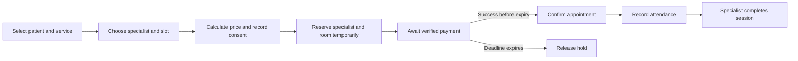

# Booking and financial workflows

Updated: 2 October 2026. Status: proposed rules with unresolved business decisions.

Booking and payment form the first workflow to define and eventually implement. A correct appointment depends on patient access, service pricing, specialist availability, room capacity, consent, and payment verification.

## Distinct business concepts

| Concept | Meaning |
|---|---|
| Account | The person authenticating and using the system |
| Patient | The beneficiary receiving treatment |
| Order and order line | The service, package, or assessment purchased and its agreed price |
| Appointment | A scheduled delivery of care |
| Payment and allocation | Money received and the order or line it settles |
| Invoice and credit note | Financial documents and corrections |
| Package entitlement | A purchased right to specified sessions |
| Wallet entry | A credit, debit, refund, or adjustment in the internal wallet |

An account can book for an authorized family member. An assessment may not need an appointment, and a package covers multiple appointments. Do not make appointments the only owner of purchases and payments.

## Normal booking flow

Temporary payment holds are explicitly deferred. Booking by bank transfer is also noted for later; no verification or hold workflow has been selected.

| Decision | Proposed starting rule |
|---|---|
| Availability | Service eligibility, specialist schedule, no overlapping booking or hold, and a room for in-person care |
| Price | Server-calculated, including specialist price, approved discount rules, and validated tax treatment |
| Confirmation | For online payment, provider-confirmed successful payment is required before the appointment becomes confirmed; retain separate fulfillment rules for paid package entitlements and eligible free follow-ups |
| Online payment | Bounded hold with a configurable deadline |
| Bank transfer | Deferred by the user. If considered later, proof alone should not confirm receipt; define staff verification and timing then. |
| Late payment | Record the payment, recheck capacity, and resolve or refund if the slot is unavailable |
| Attendance | Separate evidence from appointment completion and financial settlement |
| Completion | Authorized treating specialist records completion |

Room allocation is required at confirmation by the source. The proposed hold should reserve room capacity too, so payment does not succeed for an impossible in-person booking. Finalize the exact allocation strategy.

## State design

Keep booking state, payment state, attendance, recording state, and accounting synchronization separate. Preserve the required appointment labels through mappings to stable business meanings. Administrator-created labels must not redefine billing or authorization rules implicitly.

The source lists confirmed, pending, completed, cancelled, no-show, cancelled for nonpayment, and postponed. It also mentions processing in the patient interface. Agree the canonical transitions and presentation mappings.

The automatic no-show rule must account for recorded attendance and remote sessions continuing beyond the scheduled end. The one-time late-change exception needs a defined owner and scope, such as patient lifetime or another center-approved boundary.

**Confirmed user refinement:** Automatic no-show assignment uses the scheduled appointment start plus an administration-configured grace period. This replaces the source's scheduled-end timing for the current design. Recorded attendance or an active consultation prevents automatic no-show even when completion has not yet been entered. A mobile countdown alone never determines attendance or a financial charge.

`No-show cutoff = scheduled start instant + applicable grace period`

The grace period is configurable rather than a hardcoded 15-minute default. No numeric value has been approved. Grace and advance-reminder lead time are separate settings. Whether the grace policy can vary by appointment mode, service, or practitioner remains open.

Proposed implementation: schedule a durable cutoff check, then atomically recheck appointment state and reconciled attendance before applying a no-show and its financial/entitlement effect. Do not classify cancelled, postponed, completed, attended, or ongoing consultations through that job. Rescheduling must invalidate stale checks and establish a new cutoff. Define handling for late attendance events, provider outages, and authorized corrections.

Use policy versions for audit and finalize whether grace-period edits affect already booked appointments or only future bookings. If existing appointments are affected, replace their cutoff checks deliberately rather than leaving stale jobs to apply old timing. The cutoff is not a hard stop for an online consultation and is separate from reconnection grace.

## Confirmed patient no-show policy

The user chose retention of the fee for patient no-shows, for both in-person and online appointments.

- For a paid standalone appointment, the center retains the session payment; it is not automatically refunded or credited to the wallet.
- For a package appointment, consume one session entitlement; do not restore it merely because the patient did not attend.
- Keep the appointment classified as No-show, not Completed. Retained fees do not count as completed-session doctor incentive or monthly target revenue.
- Consumption and any financial classification must be idempotent so a repeated no-show job cannot consume another session or charge the patient twice.
- This decision applies to patient nonattendance. Late cancellation, clinician absence, center failure, and online technical-failure adjudication need their own rules; they are not automatically patient no-shows.
- Define authorized correction and restoration behavior if a no-show was assigned incorrectly. Auditing and entitlement history must preserve the original action and its correction.

For a later package refund, decide how previously consumed no-show entitlements affect the refund formula; the source example reprices completed sessions and does not settle this new edge case.

## Changes to a booking

For every cancellation, reschedule, center postponement, specialist transfer, and no-show, define the actor, deadline, financial effect, resulting state, reason, notification, and audit event.

**Confirmed cancellation direction:** If a patient cancels within the allowed cancellation window, they choose either a refund to the original payment method or credit to their wallet. For a package booking, return the reserved session entitlement to the patient's available sessions. The cutoff is administrator-configurable; no default duration has been chosen. Actual refund processing time and rules for cancellation after the cutoff remain open.

**Deferred per user:** The consequence of patient cancellation after the configured cutoff and the rescheduling rules are left for later.

**Confirmed Motmaan/doctor-initiated cancellation direction:** If Motmaan or the assigned doctor cancels, credit the patient in the internal Motmaan wallet. If the patient wants that wallet balance transferred to their bank account, they must contact administration. Define the actual payout review, approval, processing, and accounting steps later.

Online booking confirmation must use trusted payment-provider confirmation (such as an authenticated webhook or a server-side provider status check). A client redirect or app callback alone must not confirm payment. Match the provider event to the expected order and amount and make repeated notifications idempotent.

**Confirmed package direction:** Administrators create package offers and control their sale and expiry settings and package configuration. Specify the configurable fields and rules before implementation.

- Customer postponement within the modification window does not consume the session charge; after the window the source says it is charged.
- Center postponement preserves the customer's financial entitlement.
- Specialist transfers can require a price difference. Define cheaper-specialist transfers and pending difference-payment behavior too.
- A free follow-up is specified with the same specialist within 14 days, with configurable duration and service eligibility. Define eligibility trigger, usage limit, expiry boundary, and unavailable-slot behavior.
- A waiting-list offer has an exclusive confirmation/payment window. Define queue ordering and atomic reservation of the offered capacity.

## Financial rules

Use a transaction history for wallets and package entitlements. Enforce balance and consumption invariants with concurrency protection; a balance column alone is insufficient.

**Confirmed financial integration direction:** Motmaan records operational payments and refunds, then reliably syncs relevant accounting events to Qoyod. Per the user's delegation, the planning recommendation assigns official accounting/e-invoicing documents to Qoyod. Confirm exact fields, account setup, retries, corrections, and reconciliation with finance before implementation.

Snapshot prices, discounts, tax decisions, commission rules, and applicable policies when their business events occur. Define effective dates so new settings do not silently rewrite historical transactions.

Package refund example from the document: four sessions purchased for SAR 2,200; two completed sessions repriced at SAR 600 each; remaining refund SAR 1,000 to the wallet. Define late-cancellation consumption, taxes, transfers, expired sessions, and cases with no refundable remainder.

Commission is required only for completed, fully paid services. Package commission accrues as sessions complete. Full-time target-based and part-time net-revenue-sharing rules differ. Agree allocation of package discounts, rounding, and reversal of previously accrued commission after refunds.

**Confirmed user clarification:** The salary arrangement includes a monthly revenue target and a percentage incentive only on the revenue above the target. For eligible monthly revenue R, target T, and incentive rate p, the incentive is max(0, R - T) multiplied by p. Fixed salary remains separate. SAR 10,000 and 20% are examples, not approved defaults. Percentage-only compensation is the other arrangement. Detailed allocation and refund/reversal mechanics remain open in [practitioner compensation and recruitment](08-practitioner-compensation-and-recruitment.md). Fixed salary accrual must not be incorrectly restricted by the completed-and-paid-service rule.

**Confirmed revenue basis:** Target progress and incentive count completed, fully paid sessions after discounts, excluding VAT and adjusted for refunds. Package revenue is allocated as sessions complete. Refund timing and closed-period correction mechanics remain open. Patient no-shows retain payment or consume a package session as confirmed above, but do not earn this incentive or contribute to the doctor's eligible monthly target.

**Recommended planning ownership, accepted by the user:** Motmaan is the operational source of truth for orders, appointments, payments, refunds, wallet entries, and package entitlements. After verified payment or another relevant financial event, Motmaan reliably synchronizes the required accounting data to Qoyod; Qoyod issues and owns the official accounting/e-invoicing documents. Motmaan stores Qoyod references and sync status for reconciliation. Use durable retries and idempotent event handling to prevent duplicate official invoices. Validate the exact Qoyod account/API configuration and finance rules before implementation; do not issue a second official invoice in Motmaan by default.

Cash payment is accepted only at an in-person session when the patient attends. Do not treat cash as an online checkout option or as permission to confirm a booking before attendance. Booking by bank transfer is deferred for later discussion.

Tax classification must be validated with finance by service and beneficiary. Do not encode the document's nationality shorthand as a universal exemption rule. Reference: [ZATCA clarification on healthcare supplied to citizens](https://x.com/Zatca_care/status/1994204337090806266).

## Future verification scenarios

When coding begins, verify simultaneous booking of the same capacity, duplicate payment callbacks, payment after expiry, repeated wallet spending, repeated entitlement consumption, recorded attendance before a no-show job, active online sessions past scheduled end, exactly-once no-show consumption, and correction of an incorrectly recorded no-show. These are planned acceptance scenarios; no implementation or tests have been created.
