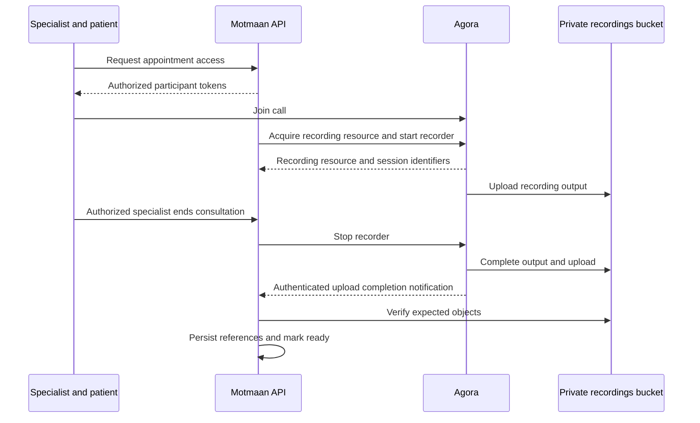

# Online sessions and recording delivery

Updated: 2 October 2026. Status: proposed Agora Cloud Recording workflow, subject to provider and storage validation.

Agora can upload recordings directly to the configured supported private bucket. The ASP.NET Core API controls the recorder and stores metadata; the usual flow does not download the video to the API and upload it again. Joining a call does not automatically enable recording.

## Proposed sequence

## Authorization and start

Check the appointment, participant ownership, permitted joining time, and recorded consent. Issue participant-specific tokens. Storage credentials must never be supplied to the web or mobile clients.

The proposed start trigger is the specialist starting the consultation with the patient present. Finalize this trigger so relevant clinical conversation is not allowed before recording is ready when recording is mandatory.

Call acquire immediately before starting: its resource is short-lived, so do not acquire it when the appointment is booked days earlier. Use a separate recorder UID, call start with storage and output configuration, and persist the resourceId and sid. Select composite audio/video for combined review unless another mode is approved; output may contain multiple assets.

Prevent concurrent duplicate starts and record attempts. Do not blindly retry a timed-out start: it may have succeeded remotely. Reconcile the outcome. Verify recording health after start, because HTTP success alone does not prove the recorder is healthy.

## Stop and completion

Use explicit consultation end rather than the nominal appointment end. The source permits sessions to continue past their scheduled duration. Define reconnect grace and handling of abandoned sessions; one participant temporarily disconnecting is not by itself a consultation end.

**Confirmed financial policy:** Patient no-shows in online sessions retain the payment or consume one package entitlement, just as in-person no-shows. They remain non-completed and earn no completed-session doctor incentive. Patient attendance events and an ongoing consultation should prevent a no-show job from treating an overrun as absence. Define how to distinguish patient absence from clinician absence or a technical failure before automatically applying the financial consequence.

**Confirmed timing:** Check for patient no-show at scheduled start plus the admin-configured attendance grace period, rather than scheduled end. Attendance grace is separate from reconnect grace and recording idle timeout; it does not terminate an attended consultation.

Keep output Processing until upload completion is confirmed. Agora event type 31, uploaded, means all recording files reached the specified cloud storage. Verify webhook signatures, match the expected recording identity, deduplicate notices, tolerate out-of-order events, and verify output objects before readiness.

Recording metadata should support appointment ID, channel, recorder UID, resourceId, sid, recording mode, state, attempt history, timestamps, failure information, output assets, and deletion due date. Store object keys rather than a permanent public URL. A conceptual lifecycle is Starting, Recording, Processing, Ready, Failed, and Deleted; failure recovery transitions still need design.

## Playback and retention

The source restricts playback to independently authorized people chosen by management. Being the treating specialist or patient does not itself grant recording-view permission.

Check the permission and recording scope before issuing playback access. Log access and available playback events; a generated URL alone proves access was granted, not that the full recording was watched. Use short-lived URLs. HLS playback may require controlled access to both playlist and segment objects.

Delete recordings after one year under the agreed interpretation of the retention start date. Include all output assets and relevant versions/replicas in deletion handling and record the deletion result. Define how backup retention prevents restoration of expired recordings.

## Provider caveat

Agora can use Agora Cloud Backup if direct upload fails; event type 32, backuped, indicates at least one file reached that fallback. It is not equivalent to all objects being available in our bucket. Confirm whether fallback storage is acceptable under the center-controlled-storage requirement. If prohibited, establish a supported recording architecture that satisfies the constraint before choosing Cloud Recording.

Saudi bucket location alone does not guarantee Saudi media processing. Validate the exact storage vendor and region, recording configuration, fallback behavior, and contractual processing arrangement.

## Planned proof of concept

Use synthetic content to test join, consent gating, recorder readiness, duplicate start, interruption/reconnection, explicit end, finalization delay, duplicate callbacks, bucket upload failure, output verification, restricted playback, and deletion. This is a future validation plan; no implementation has started.

## References

- [Agora REST recording quickstart](https://github.com/AgoraIO/docs-portal/blob/main/content/docs/en/realtime-media/cloud-recording/rest-quickstart.mdx)
- [Agora recording notifications and backup behavior](https://docs.agora.io/en/realtime-media/cloud-recording/build/handle-events/receive-notifications)
- [Agora recording options](https://www.agora.io/en/products/recording/)
