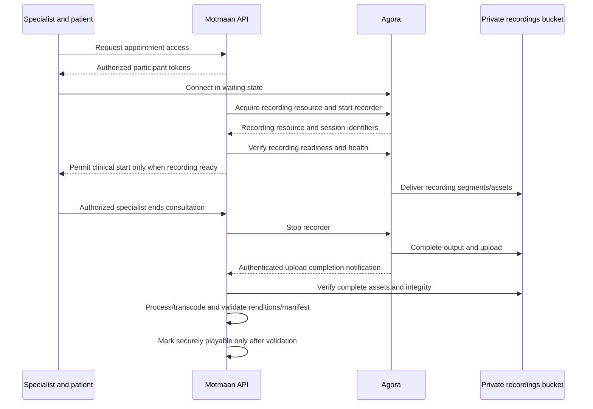

# Online sessions and recording delivery

Updated: 8 October 2026. **AUD-06: Confirmed — Critical Requirement.** This document owns recording/media reliability and adaptive playback. Validate the design against Agora and the selected storage path. No implementation or acceptance test has been performed.

Agora remains the preferred recording direction unless testing demonstrates it cannot satisfy the requirements. Its documented direct delivery to a supported private bucket is a candidate architecture, not proof that Motmaan's destination/network works. The ASP.NET Core API controls the recorder and stores metadata; the usual flow does not download the video to the API and upload it again. Joining a call does not automatically enable recording.

**Confirmed on 4 October 2026:** Every online consultation must be recorded for safety and performance review. Offering an unrecorded consultation is not selected. Preserve recorded consent and independently authorized playback; this does not grant patients or all doctors access to recordings. Exact consent/refusal handling and recorder-unavailable or mid-session recorder-failure behavior remain open; do not assume mandatory recording means bypassing consent or proceeding without recording.

## Proposed sequence

## Authorization and start

Check the appointment, participant ownership, permitted joining time, and recorded consent. Issue participant-specific tokens. Storage credentials must never be supplied to the web or mobile clients.

The proposed start trigger is the specialist requesting clinical start with the patient present. **Confirmed:** verify recording readiness before allowing the clinical consultation to begin. Connection, readiness and active capture are distinct; neither a connected call nor HTTP start success proves healthy recording. Consent/refusal handling and the operational response to mid-session capture failure remain open; these gaps do not permit an unrecorded consultation option.

Call acquire immediately before starting: its resource is short-lived, so do not acquire it when the appointment is booked days earlier. Use a separate recorder UID, call start with storage and output configuration, and persist the resourceId and sid. Select composite audio/video for combined review unless another mode is approved; output may contain multiple assets.

Prevent concurrent duplicate starts and record attempts. Do not blindly retry a timed-out start: it may have succeeded remotely. Reconcile the outcome. Verify recording health after start, because HTTP success alone does not prove the recorder is healthy.

## Stop and completion

Use explicit consultation end rather than the nominal appointment end. The source permits sessions to continue past their scheduled duration. Define reconnect grace and handling of abandoned sessions; one participant temporarily disconnecting is not by itself a consultation end.

**Confirmed financial policy:** Patient no-shows in online sessions retain the payment or consume one package entitlement, just as in-person no-shows. They remain non-completed and earn no completed-session doctor incentive. Patient attendance events and an ongoing consultation should prevent a no-show job from treating an overrun as absence. Define how to distinguish patient absence from clinician absence or a technical failure before automatically applying the financial consequence.

**Confirmed clarification on 4 October 2026:** If a connection problem prevents completion, management may review the case and grant the patient a free replacement session. The patient may open a support ticket to request review. Replacement is discretionary after management review, not automatic on disconnection or ticket submission. The user's expectation of reliable internet is an operating expectation, not measured provider availability. Review criteria, granted-session eligibility/expiry/practitioner, partial-session accounting and correction of an incorrectly assigned no-show remain open. No blanket partial-charge rule, automatic refund or automatic Finished transition is selected.

**Confirmed timing:** Check for patient no-show at scheduled start plus the admin-configured attendance grace period, rather than scheduled end. Attendance grace is separate from reconnect grace and recording idle timeout; it does not terminate an attended consultation.

Keep output Processing until upload completion is confirmed. Agora event type 31, uploaded, means all recording files reached the specified cloud storage. Verify webhook signatures, match the expected recording identity, deduplicate notices, tolerate out-of-order events, and verify output objects before readiness.

Recording metadata should support appointment ID, channel, recorder UID, resourceId, sid, recording mode, state, attempt history, timestamps, failure information, output assets, and deletion due date. Store object keys rather than a permanent public URL. The lifecycle must distinguish video connection, recording readiness, active recording, recording interruption, recording completion, media upload/ingestion, processing, playback readiness, and failure/recovery/deletion. Serialized states and recovery transitions remain engineering work.

## Confirmed resumable transfer and recovery — AUD-06

If a supported upload stops at **48%**, resume from the last **server-confirmed committed chunk or segment**, rather than restarting from zero. A client progress percentage is not evidence of committed content.

Required capabilities for supported transfer flows:

- Chunked/multipart transfer with unique upload-session identifiers, persistent progress and server confirmation of completed parts.
- Resume after temporary disconnect and application/worker restart; bounded safe retries with exponential backoff and idempotent part submission.
- Part validation and checksums where supported; detect missing, duplicated or corrupted parts. Verify final assembly and completeness before accepting the asset.
- Authorized upload-session access, safe credential renewal without losing verified progress, proper cancellation/cleanup, clear backend progress/failure states and operational monitoring.

A client file uploader and a managed recorder have different recovery boundaries. Investigate actual Agora capture, cloud delivery, segmentation, storage and recovery capabilities before finalizing the design. A generic chunk uploader cannot resume an internal provider operation by assumption. If output is segmented, track each segment independently and verify/recover its ingestion. **Recoverable upload interruption is distinct from irrecoverable loss of live capture:** do not claim that missing footage can be reconstructed without provider evidence. Unsupported provider recovery must be exposed as a capability gap, not silently described as reliable resume.

## Confirmed processing and adaptive playback — AUD-06

Pipeline: **Recording completed → asset verification → processing/transcoding → rendition generation → manifest validation → secure playback readiness.** Processing is retryable and observable, with verified checkpoints and meaningful failures; retain originals until safe disposition under the approved lifecycle. Partial or corrupted recordings must never be marked fully processed.

Plan adaptive streaming using HLS or MPEG-DASH where justified. Generate available renditions such as **1080p, 720p, 480p and 360p** only when supported by the original recording. Automatically select quality for network conditions; manual selection is supported where practical. Do not upscale poor source footage just to advertise higher resolution. Exact codecs, rendition ladder, worker/transcoder and format remain validated engineering choices.

## Mandatory future acceptance scenarios

1. Internet interruption at 48% upload progress.
2. Successful resume from the last server-confirmed part without retransmitting every completed part.
3. Duplicate chunk submission has no duplicate effect.
4. Server or worker restart preserves upload progress; also validate app restart recovery.
5. Expired upload credentials require safe renewal/current authorization without losing verified progress.
6. Corrupted media part prevents false completion.
7. Missing media segment prevents false completion and exposes recovery/failure.
8. Recording failure before consultation blocks clinical start; connection alone never passes readiness.
9. Recording interruption during consultation is detected/reported; test the eventual approved clinical response without pretending lost footage is recoverable.
10. Failed transcoding followed by successful retry produces validated outputs once.
11. Adaptive playback switches among available qualities as network conditions change.
12. Unauthorized playback is denied; include expired/revoked grants and cross-patient/branch upload-session access.
13. Storage or recording-provider outage exposes truthful state, monitoring and supported recovery.

These are future acceptance requirements, not completed tests. [Private-file lifecycle](03-integrations-and-storage.md#secure-file-lifecycle--aud-23) applies the transfer design to ordinary supported uploads without requiring PDF/image video processing.

## Playback and retention

The source restricts playback to independently authorized people chosen by management. Being the treating specialist or patient does not itself grant recording-view permission.

Check the permission and recording scope before issuing playback access. Log access and available playback events; a generated URL alone proves access was granted, not that the full recording was watched. Use expiring access grants. Signed URLs alone do not satisfy every sensitive playback case: evaluate revocation, network restrictions and playback control. Protect manifests and every segment/rendition, with private storage, appropriate encryption and audit trails. Backup/recovery must follow approved retention and deletion rules; downloaded content cannot be recalled by revoking a grant.

Delete recordings after one year under the agreed interpretation of the retention start date. Include all output assets and relevant versions/replicas in deletion handling and record the deletion result. Define how backup retention prevents restoration of expired recordings.

## Provider caveat

Agora can use Agora Cloud Backup if direct upload fails; event type 32, backuped, indicates at least one file reached that fallback. It is not equivalent to all objects being available in our bucket. Confirm whether fallback storage is acceptable under the center-controlled-storage requirement. If prohibited, establish a supported recording architecture that satisfies the constraint before choosing Cloud Recording.

Saudi bucket location alone does not guarantee Saudi media processing. Validate the exact storage vendor and region, recording configuration, fallback behavior, and contractual processing arrangement.

The [4 October provider review](17-provider-documentation-development-notes.md#online-sessions-and-recording-agora) records current storage configuration and event-verification details. The official reference now includes an S3-compatible endpoint option; it still requires proof against the chosen Saudi destination. Recording retention must also account for recoverable deleted objects, versions, replicas, and backups; see the review's storage section. Neither public capability establishes account-specific readiness.

## Planned proof of concept

Use synthetic content to test join, consent gating, recorder readiness, duplicate start, interruption/reconnection, explicit end, finalization delay, duplicate callbacks, bucket upload failure, output verification, restricted playback, and deletion. This is a future validation plan; no implementation has started.

## References

- [Agora REST recording quickstart](https://github.com/AgoraIO/docs-portal/blob/main/content/docs/en/realtime-media/cloud-recording/rest-quickstart.mdx)
- [Agora recording notifications and backup behavior](https://docs.agora.io/en/realtime-media/cloud-recording/build/handle-events/receive-notifications)
- [Agora recording options](https://www.agora.io/en/products/recording/)
