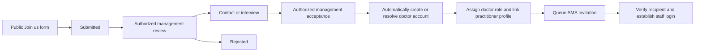

# Practitioner compensation and public recruitment

Updated: 8 October 2026. Status: confirmed user capabilities with proposed detailed workflows.

The user confirmed a percentage compensation arrangement and a salary arrangement with an incentive on monthly revenue above a target. In the first stage, candidates apply for doctor roles through the public Join us route; administrators control openings and applications. Authorized acceptance automatically creates or safely resolves the doctor account, assigns the doctor role, and schedules an SMS invitation. Other job types may be added later. No application code or actual external communications are part of this planning update.

Management controls whether a doctor is active. Only active doctors can log in to the doctor dashboard. Management verifies degrees and applicant data before activation; the detailed verification procedure remains open. Deactivation effects on existing sessions and reactivation remain deferred.

**Confirmed:** Employed and external doctors use the same operational behavior and access rules, within permissions, assigned-patient scope, and branch scope. Prioritize available salary-paid practitioners in discovery/booking; preserve external fallback when prioritized practitioners are full over the selected dates and matching filters. Compensation remains distinct. Search uses start/end dates; equal dates mean one day. Evaluate fallback over the selected range and matching filters; mixed-date display remains open.

## Compensation arrangements

| Arrangement | Confirmed intent | Details to agree |
|---|---|---|
| Salary with target incentive | Fixed salary plus a percentage of eligible monthly revenue above the practitioner's target | Salary amount, target, incentive rate, eligible revenue, period boundaries, adjustments, approval and payment tracking |
| Percentage | A practitioner can receive a share of eligible service revenue | Rate, revenue base, service eligibility, allocation, rounding, accrual and reversal rules |

**Confirmed system control:** Percentage rates must be changeable through the system. Rates vary by practitioner and use net revenue after tax and discounts. Additional deductions implied by “and so on,” service-specific overrides, edit authority, and approval/audit requirements remain open. Do not hardcode an example rate as a default.

This clarification matches the source's salary-plus-target-incentive concept. It resolves the earlier open question about whether salary can include a percentage incentive. The percentage-only arrangement remains separate; ordinary percentage on all services must not be added to the salary plan unless separately requested.

## Monthly target incentive

Let R be the practitioner's eligible revenue for the month, T the monthly target, and p the incentive rate. The confirmed structure is:

`Monthly incentive = max(0, R - T) * p`

`Compensation earned = applicable fixed salary + monthly incentive`

Only revenue above the target earns this incentive; reaching the target does not retroactively apply the percentage to the entire month. The target concerns the practitioner's attributable revenue for the clinic, not their salary amount or the clinic's total revenue from all practitioners.

Illustrative configurable terms: T = SAR 10,000 and p = 20%. The user supplied these as examples, not global defaults.

| Eligible monthly revenue | Revenue above target | Incentive in the example |
|---|---|---|
| SAR 8,000 | SAR 0 | SAR 0 |
| SAR 10,000 | SAR 0 | SAR 0 |
| SAR 12,000 | SAR 2,000 | SAR 400 |
| SAR 15,000 | SAR 5,000 | SAR 1,000 |

For a service crossing the target, apply the rate only to the portion above it. Example: cumulative eligible revenue is SAR 9,800 and the next eligible service adds SAR 600. Only SAR 400 is above the target, so the additional incentive is SAR 80.

Proposed per-service accrual is p multiplied by the change in max(0, cumulative monthly revenue minus target). This is an implementation proposal; finance must define refund reversals and month-close corrections before using it. A monthly finalized calculation with an auditable service breakdown is another implementation option.

The monthly target resets for each reporting month. Define the calendar boundary in Riyadh time, the event date used to attribute service revenue to a month, new-hire target proration, and whether terms can change mid-month. No actual salary amount, practitioner-specific target, or rate has been selected.

Store the compensation arrangement independently from job title, portal role, and practitioner profile. A practitioner role does not reveal or determine their pay. Employment category and compensation model may be related, but the approved contract should own the arrangement.

Proposed design: effective-dated compensation terms and distinct accrual/payment histories. Keep salary obligations separate from service-based percentage accruals, and distinguish an amount earned or owed from an amount paid. Changes to future terms must not silently recalculate approved historic amounts.

The fixed salary is a contractual amount per agreed period, adjusted only through defined rules. Its target incentive is calculated separately. The source's completed-and-paid-service restriction applies to commission/incentive, not automatically to salary. Whether we only track salary terms and reports or implement full payroll, deductions, leave calculations, payslips, and bank payouts is open.

**Confirmed:** Monthly target progress and above-target incentive count completed, fully paid sessions only, using revenue after discounts, excluding VAT, and adjusted for refunds. Package revenue contributes as each session completes, using its allocated revenue rather than the entire package purchase. Attribute the revenue to the practitioner who actually performed the session. Non-completed sessions, including no-shows, do not generate this incentive merely because the clinic retains a fee.

Use the same eligible base for monthly target progress and above-target incentive. The source's percentage-only arrangement likewise specifies completed and fully paid services on a net basis. Detailed discount allocation, refund timing, period-close corrections, assessment completion eligibility, monetary rounding, and future insurance adjustments remain to be defined.

Only authorized management/finance users can manage terms. A specialist may view their own approved arrangement and statements if granted; access to other practitioners' compensation is not implied. Audit edits, approvals, reversals, and payments. Define how the relevant records map to Qoyod without duplicating internal accrual and accounting entries.

## Compensation details during development — AUD-14

**During Development:** retain confirmed salary, practitioner-specific percentage and above-target incentive formulas and completed/fully-paid eligibility. Resolve and document period attribution, refund corrections, mid-period term changes, closed statements and earned-versus-paid amounts during the affected implementation. Developers must obtain owner/finance decisions where treatment changes salary/commission policy; this status does not permit invented finance rules. Do not block unrelated development or turn statements into a payroll engine by assumption. Further deductions, service rates, rounding and the source fixed-amount alternative remain open business details.

## Public Join us flow

The initial Join us scope is doctor recruitment only. Administrators control whether openings are available and manage submitted applications. Support for other job types is a possible later expansion, not first-stage scope. Exact vacancy-versus-general-application behavior remains open.

Doctor candidates identify their areas of expertise from an editable database-backed catalog (for example, a concern or treatment area). The same catalog is linked to doctor profiles so patients can filter doctors by a concern. Catalog ownership, language labels, candidate entry/approval rules, and which profile details are public are described in [practitioner expertise](13-practitioner-expertise.md). Candidate expertise should not be treated as a credential or clinical endorsement by itself.

**Confirmed application information:** Use the existing Motmaan specialist form as the field/document reference, plus a multiple-selection therapeutic-expertise field. The observed required uploads are CV and Saudi Commission for Health Specialties certificate. See the [current website field reference](19-recruitment-current-website-reference.md) for all common, specialist, administrative, and conditional fields. Management verification before activation and public-profile mapping remain separate and open.

The user returned to the applicant-field question and directed a website review. The baseline is now documented; additional credential evidence, file validation, and verification procedure remain open.

The main website provides a Join us page that works on mobile and desktop. Candidates provide the normal doctor-applicant personal information, expertise, and degrees/academic qualifications. Management reviews their application, interviews them, and approves expertise/degrees for the public profile before acceptance. The clinic-identity wording is interpreted as the center name, logo, and branding, not applicant tracking or disclosure of a visitor's identity. Baseline fields/documents are recorded from the current site; interview process, extra credential evidence, public fields, and brand assets remain open.

Candidates can submit a general interest application or apply to a vacancy if vacancies are included. A full vacancy publishing module has not yet been confirmed. The observed baseline includes personal/contact data, qualifications, specialty/department, professional classification, experience, requested role and work type, employment/license questions, required CV and required health-specialties certificate; expertise is the user's additional multi-select requirement. Do not collect patient medical history or unnecessary identity documents in this form.

Public application submission does not require granting a patient or staff dashboard account. Contact verification is a proposed abuse and contact-quality control; its timing and channel are open. An optional candidate tracking portal is not yet requested.

## Acceptance and automatic account provisioning

Suggested application statuses are Submitted, Under review, Contact planned or Interviewing, Accepted, Rejected, and Withdrawn. These labels are proposals. **Confirmed:** The authorized acceptance action itself triggers account provisioning, doctor-role assignment, and SMS delivery; do not require a second manual account-creation or role-assignment step. Keep invitation delivery and first-access setup states separate from the application decision.

Credential checks and any employment review needed for the management decision should happen before acceptance. The accepted doctor does not need another discretionary approval merely to receive their account. First-access verification is a proposed authentication step, not a second hiring approval.

### Proposed reliable acceptance workflow

1. Check the reviewer's sensitive acceptance permission and that the application is eligible for acceptance.
2. In an atomic database workflow, record acceptance, provision or safely link the account, create/link the practitioner profile, assign the configured doctor role, and write an SMS invitation outbox entry plus audit records.
3. After the database commit, a durable worker sends the SMS and records provider/delivery state. Do not hold the database transaction open while sending SMS.
4. Show management account-provisioning and invitation status separately. If sending fails, retry and allow an authorized resend without recreating the account or rolling back an already valid acceptance.

Use a unique application-to-provisioning association and idempotent processing so repeated clicks, concurrent requests, or retries do not create multiple users, roles, profiles, or invitations. An unresolved identity conflict should leave acceptance uncommitted or in a clearly labeled exception workflow, rather than an accepted application with silent partial account creation. Finalize identity reconciliation before coding.

Assign the approved doctor-role template, never a role supplied by the public form. Doctor-role membership does not grant independent sensitive permissions such as financial refunds or recording playback.

### Proposed SMS invitation and first access

The SMS acknowledges acceptance and provides a short-lived first-access link or code to the staff portal. Its exact template and login mechanism are open. Do not send a reusable password in SMS. Verify control of the invitation destination and establish the approved staff authentication method, including mandatory privileged verification where AUD-08 applies; exact mechanisms remain technical design.

Store invitation state, expiry, and use securely. Staff activation through this flow must not make ordinary patient OTP sufficient for staff access. Scheduling, service assignments, and compensation settings are separate configuration; absent schedules must not create public bookable availability automatically.

Management review should show authorized candidate details, private documents, status, assigned reviewer, internal notes, and contact/interview history. Filter lists by specialty, date, status, and reviewer where needed. Keep an immutable audit trail of sensitive decisions; editable recruiter notes do not replace it.

Contacting a candidate is a supported future workflow, not an instruction to call or message anyone now. Acceptance SMS is confirmed; additional submission acknowledgments, email, or rejection notices remain open. Agree templates and delivery configuration, and keep internal notes out of candidate-facing messages.

Link automatically provisioned staff/practitioner records to the accepted application rather than exposing the recruiting record publicly. Avoid duplicate identities when the person is already a patient, while retaining separate patient and staff authentication contexts. Resolve existing identities through verified evidence or authorized review; matching a phone number alone must not silently transfer an existing account to a candidate.

Public employment recruitment is distinct from the source's external-doctor marketplace, which includes external self-registration, platform accreditation, commissions/wallets and marketplace operations. The source called it future work, but that phasing is superseded by the user's broad first-stage direction. Keep those capabilities separately visible in the scope inventory, reconcile their exact use cases with Motmaan-only operations, and do not silently implement them through the simple doctor-only Join us workflow. Detailed acceptance criteria remain open; see review finding R01 in the [readiness review](20-development-readiness-review.md).

## Upload and access handling

Use a separate private recruitment storage area or bucket with recruitment-specific permissions and retention. Validate allowed content, sizes, and file types; scan uploaded documents before reviewer access. Generate object keys and store only references in the database. Public form submission must not expose bucket credentials or allow arbitrary object access.

Bound submissions and uploads, protect against automated abuse, and handle retries without accidental duplicate applications. Agree duplicate-contact and repeat-application behavior rather than treating all applications sharing a contact as one person. If using upload links, scope them to a pending application and complete the submission only after validated upload completion.

Define candidate privacy wording, document access, retention, withdrawal, and deletion separately from medical-record and session-recording policies.

## Decisions still needed

Settle practitioner-specific rates/terms, optional service-specific rates, further net-revenue deductions, salary frequency, period attribution, refund timing/month-close corrections, package price allocation, assessment completion eligibility, payroll scope, named openings versus a general doctor application, contact verification, upload limits/extra credential documents beyond the observed baseline, credential verification, who can accept, existing-identity reconciliation, staff invitation setup, the acceptance SMS template, additional notifications, and candidate-data retention. Automatic doctor account creation/role assignment after acceptance and the net completed-and-paid-session basis for monthly incentives are already confirmed.

Related notes: [Identity and access](05-identity-and-access.md), [Booking and finance](02-booking-and-finance.md), and [Quality priorities](09-performance-security-and-responsive-websites.md).

## Latest compensation, discovery, and recruitment clarification — 4 October 2026

- Practitioner percentage compensation differs by practitioner, using net revenue after tax and discounts. Do not assume unspecified deductions. Above-target commission applies only to additional eligible revenue above the configured target; the prior salary/incentive structure is reconfirmed.
- For a discounted SAR 1,000 four-session package originally SAR 1,200, session revenue allocation is SAR 250. Refund after two used sessions reprices them at SAR 300 each and returns SAR 400; see [finance](02-booking-and-finance.md). Refund-related commission reallocation/reversal remains open and must not be inferred from patient refund repricing.
- Patient-facing priority is for available salary-paid practitioners ahead of percentage-paid practitioners. Retain branch/date/filter scope and the existing external fallback policy; tie-breaking and mixed-date display remain open. Compensation terms/rates stay private.
- Current recruitment fields were reviewed at the user's request for both specialists and administrative applicants. Administrative roles are recorded as a reference; the initial doctor-only job scope and automatic doctor provisioning rule are not expanded by that review. See the [field reference](19-recruitment-current-website-reference.md).
