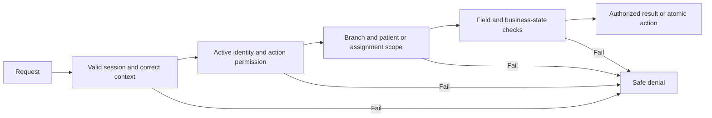

# Authentication and authorization workflows

Updated: 5 October 2026. **Detailed planning draft.** The user selected authentication, authorization and external providers as the next workflow to clarify. This returns relevant access questions to active discussion. Owner answers are marked confirmed below; remaining proposals are not approved and application implementation is not authorized.

## Status and ownership

This document owns the detailed workflow draft and decision IDs for this discussion. [Identity and access](05-identity-and-access.md) owns access principles and previously confirmed rules; [patient login](07-patient-login-and-recovery.md) owns the patient policy; [provider guide](16-external-provider-guide.md) owns provider selection/setup status. Owner questions stay in [the living tracker](12-user-notes-and-open-questions.md). Update all affected files when an answer arrives.

**Confirmed baseline:** patient phone OTP; optional username and verified recovery email; established-email recovery can replace a lost phone without administration review; staff login by username, verified email or phone number plus password; staff SMS additional verification enabled by default, self-managed, with authorized administrator control over all accounts; active doctors only; assigned-patient and branch scope; automatic doctor provisioning and SMS invitation after authorized acceptance. Public applications, family membership and patient authentication do not grant staff powers.

Everything labeled **proposed** below is a reviewable recommendation. Patient SMS defaults, operational role baseline, sensitive grants/authority, recovery actors, session limits, adult consent and staff SMS-change safeguards are confirmed below. Imported linking is adopted by delegated design. No provider accounts currently exist; ownership/delegation and production approval are confirmed. Vendor choices, technical mechanisms, other numeric settings, individual assignees and detailed evidence/permission contracts remain open.

## Identity concepts

| Concept | Responsibility and boundary |
|---|---|
| Account | Immutable identity of the person signing in; contact information may change without changing account identity |
| Patient | Beneficiary with an independent clinical history; not necessarily the payer or signing-in person |
| Account-to-patient access | Verified relationship plus permitted actions, evidence, effective period and revocation; a matching phone is insufficient |
| Staff profile | Staff workspaces, branch assignments, roles, active status and staff authentication context |
| Practitioner profile | Professional eligibility, active status and links to assigned patients/encounters; not a compensation grant |
| Session | Account, authentication context, creation/expiry, device reference and revocation state |
| Challenge | Purpose, destination, expiry, attempt budget and single-use verification state; delivery is a separate process |
| Role and permission | Role bundles supported actions; each action still requires resource scope and business eligibility |

Proposed: one account may link to both patient and staff profiles where identity is verified, with separate patient/staff sessions. Never merge two existing accounts solely by shared contact information. Branch selection filters already-granted scope; it does not create a grant.

## WF-AUTH-01 — Patient sign-in and first access

1. Patient opens the website/app and enters a normalized phone number. Show Arabic/English validation without disclosing existing medical files.
2. Backend creates a purpose-bound login challenge within delivery/abuse limits. Return an opaque challenge reference, masked destination, server time, expiry and resend eligibility. Never return the code.
3. Configured provider sends the code by **SMS, confirmed by the owner**. Patient defaults: six digits, five-minute validity, earliest resend after 60 seconds and five failed verification attempts per challenge. These are configurable security settings; additional rate budgets remain proposed.
4. Patient submits challenge reference and code. Backend checks purpose, expiry, attempts and prior use, then consumes verification atomically. Duplicate requests must not create two accounts or independently reusable grants.
5. An existing verified account enters only its authorized patient context. A new account receives only the limited registration/profile workflow until required fields and access links are established.
6. **Imported-file gate, selected by delegated design:** prepare and validate account-to-patient links during migration. Only evidence-backed verified links become usable after account authentication. Reception reviews unverified, shared-phone, changed-phone or ambiguous cases before granting access. Never reveal candidate clinical records to the caller or mark a link verified solely because phone numbers match.
7. Return permitted patient contexts and allowed next actions. The client selects only among those contexts. Clinical fields/files are fetched separately under current access.

Proposed starting rules: one current verified login phone per account; several family patient profiles can have a shared contact without becoming several accounts for that phone. A phone already assigned to another account must enter a conflict-resolution process. The imported-link approach (A04) is resolved by delegated design; exact proof/checklist and required new-patient fields remain to specify. Assisted-recovery actors are confirmed in A05; evidence and execution details remain open.

### Imported-record linking — selected approach A04

The owner delegated the choice of the correct approach. Use verified prelinking during migration with reception handling exceptions, so patients with established evidence do not need a new reception visit just to read their existing file.

1. Build a reconciliation register using stable source patient IDs and target patient/account IDs. Preserve individual clinical histories and family beneficiaries.
2. Distinguish a candidate match from a verified access relationship. Record the evidence reference, permitted actions, verifier, verification time and branch. An import success or matching phone/name/identity number alone is not identity proof.
3. An authorized verifier marks a link usable only when its evidence establishes the account-holder's entitlement to that specific record. If evidence is absent or inconsistent, leave the link pending reception review.
4. On first SMS sign-in, authenticate the account and evaluate current verified links. Display permitted records only. Missing/pending links show a neutral contact-reception state without exposing possible matches.
5. Reception uses an approved identity/relationship checklist, resolves duplicate or changed contacts and records the result. Parent/guardian authority is separately validated; shared package usage does not grant family clinical access.
6. Corrections/rejection revoke or replace the access relationship with audit history. Do not delete the patient's clinical record or silently merge accounts.

The approach is an adopted planning decision **by delegation**, not a claim that migration data has already been verified. Evidence requirements, who can finalize links, guardian proof and correction/appeal handling remain detailed implementation prerequisites. Emdaad export formats remain deferred.

States for review: `Challenge pending`, `Code entry`, `Verified`, `Profile required`, `Identity review required`, `Authenticated`; terminal challenge outcomes `Expired`, `Superseded`, `Attempts exhausted`. These are conceptual labels, not final API enums.

## WF-AUTH-02 — Staff and doctor sign-in

**Confirmed main credential:** username, verified email or phone number plus password. All three identifiers resolve to the same staff account; patient phone OTP remains separate. A01 is resolved. Proposed: normalize identifiers, prevent ambiguous cross-account matches and verify the established phone before enabling SMS; exact identifier enrollment/uniqueness rules remain technical work.

1. Staff submits the approved credential. Backend validates it and checks account/staff/practitioner eligibility without exposing whether a particular account exists in public failure messages.
2. If staff additional verification is enabled, create a staff-login SMS challenge sent to the established verified phone. Do not issue a usable staff session before it succeeds.
3. If disabled under the approved setting policy, complete the base-credential flow. A request from the client cannot choose to skip an enabled challenge.
4. After successful authentication, return authorized workspace choices, role-derived actions and branch scope. A doctor requires active practitioner status as well as staff eligibility.
5. If only one workspace is permitted, open it; if several are permitted, show a chooser. Proposed: reception/accountant use filtered management navigation, not separate identity systems.
6. An authenticated account with no authorized workspace sees a limited contact-administration screen, with no clinical/financial data.

**Confirmed setting:** SMS additional verification is enabled by default. Every staff member/doctor can enable or disable their own setting. An administrator with the appropriate permission can control it for all accounts. A02 is resolved; this grants no unrelated clinical, financial or provider authority. Patient login OTP is unaffected. An outage must not disable verification automatically.

**Confirmed change safeguard:** require password confirmation and a code sent to the existing verified phone before self-service disabling SMS verification or changing its phone. Lost-factor cases use the separately defined recovery flow. Enabling requires a verified phone. Record actor, target, old/new setting and time; notify the affected person through established channels. Administrative changes need the explicit action grant and audit. Concurrent setting changes use a version check; no mandatory role override is assumed. A pending login must restart with current policy rather than becoming authenticated merely because a toggle changed. The password/existing-phone safeguard is confirmed; audit, concurrency and administrative-change mechanics remain engineering proposals. Default-on verification remains user-configurable.

Proposed password baseline for review: minimum 15 characters, support at least 64 characters without silent truncation, allow password managers/paste, screen common/compromised values, and require change after compromise/reset rather than an arbitrary periodic schedule. Use maintained password hashing/verification libraries. This is a recommendation; do not copy framework tutorial defaults as the product policy.

## WF-AUTH-03 — Provisioning and staff first access

- Authorized recruitment acceptance creates/resolves the doctor identity and configured role, as already confirmed. Other staff are provisioned by an authorized account administrator; there is no public staff registration route.
- Proposed invitation flow: single-use invitation sent by SMS, verification of the established recipient, setup of the selected staff credential, and completion of required verification. Invitation use cannot select arbitrary roles or skip active-status/qualification checks.
- Keep acceptance, account provisioning, invitation delivery, credential setup and public bookable status separate. SMS failure allows an audited resend of an invitation; it must not recreate the doctor or undo valid hiring acceptance.
- Proposed invitation expiry: 24 hours; resending supersedes the previous invitation. Do not send a reusable password. Account-identity conflicts need approved review before any existing account is linked.
- Proposed first-admin bootstrap: the center names the initial responsible person; a controlled one-time provisioning process establishes their verified contacts and limited access-management authority. Remove bootstrap capability after use. This does not imply clinical/recording access. The owner verifies recovery of the last available administrator (confirmed A08); the evidence procedure and initial provisioning details remain to define.

## WF-AUTH-04 — Recovery and contact changes

| Situation | Confirmed or proposed workflow | Outcome |
|---|---|---|
| Patient controls current phone | Confirmed normal phone OTP | Same account and existing verified patient links |
| Patient lost phone, has established verified email | Confirmed email proof is sufficient without administration review; verify the replacement phone before completing the change | Same account; proposed revoke prior sessions/challenges and notify established safe channels |
| Patient knows username only | Proposed lookup to an established verified channel; username alone proves nothing | Limited recovery flow, never direct account access |
| Patient controls neither established phone nor email | **Confirmed:** reception verifies identity; an authorized account administrator approves recovery | Preserve the same account; exact evidence/checklist and recovery mechanics remain to define |
| Signed-in patient changes phone/email | Proposed recent verification of an established channel, verify new contact, check uniqueness/conflicts, commit atomically | Existing contact remains valid until successful replacement; revoke affected sessions/challenges |
| Staff forgets password | Proposed single-use reset through established verified staff email; require configured SMS verification before re-establishing staff access | Reset does not grant additional roles or bypass active status |
| Staff loses verification phone | **Confirmed:** an authorized account administrator restores the lost SMS factor after verifying staff identity; the owner verifies recovery of the last available administrator | Restore established staff identity only, with audit and session revocation |

Proposed: email/username remain recovery identifiers for patients, not new normal-login methods. Recovery email must be unique among accounts eligible for email recovery; normalize conservatively rather than rewriting provider-specific email punctuation. Use a restricted recovery grant that cannot read clinical/financial data, change roles or bind a different patient. Patient assisted-recovery actors are confirmed in A05; patient/staff evidence checklists and recovery mechanics remain open; A08 staff recovery and last-admin authority are confirmed. No OTP/provider support agent may manually mark a challenge verified merely because delivery failed.

## WF-AUTH-05 — Challenge settings and delivery failure

The four patient SMS defaults below are **confirmed**. Staff SMS, invitation/email expiry and aggregate send budgets remain proposals. Settings must be enforced centrally and reviewed against provider delivery behavior.

| Setting | Proposed value / behavior |
|---|---|
| Patient SMS code — confirmed | Six random decimal digits; expires after five minutes |
| Staff SMS code — proposed | Same six-digit/five-minute starting values; not approved by the patient-default answer |
| Patient verification attempts — confirmed | Five failed attempts per challenge; invalidate it afterward. Additional layered abuse budgets remain proposed |
| Patient resend interval — confirmed | Earliest after 60 seconds |
| Aggregate send budget — proposed | At most three sends per destination/purpose per rolling 15 minutes as an initial tuning value; not approved by the resend-interval answer |
| Reissued code | New challenge supersedes old one; resend does not reset aggregate attempt/rate budgets |
| Recovery/email verification link | Single-use, 15-minute expiry; purpose and established target bound to the server-side request |
| Staff invitation | Single-use, 24-hour expiry; no permanent password in a message |
| Pending action | Server supplies expiry/retry times; refresh/resume never restarts a deadline |

Use layered limits with temporary backoff so an attacker cannot permanently lock out a user by submitting requests. Keep destination disclosure and failure timing consistent. Protect low-entropy OTP verification material with server-side keyed protection, not a readily brute-forced plain hash dump. Codes/secrets must not enter logs, analytics or persistent client storage.

Provider acceptance, delivery receipt and user verification are different states. During outage, keep an enabled verification step required and show retry/help without a bypass. Retries/fallback must respect challenge expiry and supersession. No automatic SMS-to-WhatsApp or email substitution is selected; any route must be explicitly approved and preserve challenge purpose. Limits must apply across application instances.

## WF-AUTH-06 — Web and mobile sessions

**Technical proposal:** ASP.NET Core Identity for account/password lifecycle, with Motmaan use cases controlling phone OTP, verified patient links, staff assurance and resource access. A maintained library should handle session/token cryptography. This does not select a hosted identity provider or authorize copying all default Identity endpoints.

| Surface | Proposed mechanism | Lifetime status |
|---|---|---|
| Staff web | Secure HttpOnly cookie with server-side session/revocation checks; scoped cookies and CSRF protection | **Confirmed:** 30-minute inactivity timeout, eight-hour absolute session limit; warn before expiry and protect clinical drafts through an agreed workflow |
| Patient web | Secure HttpOnly cookie with independent patient context, CSRF protection and private-cache rules | **Confirmed:** 30-minute inactivity timeout, 24-hour absolute limit |
| Patient Flutter | Short-lived access token and revocable rotating refresh session; refresh credential in platform secure storage | **Proposed:** 15-minute access lifetime. **Confirmed:** refresh session expires after 30 days of inactivity or 90 days absolute |

The owner confirmed the staff/patient web inactivity and absolute limits and patient-app refresh-session inactivity/absolute limits in A07. The 15-minute mobile access-token lifetime and cookie/token mechanisms remain engineering proposals. Active calls, long forms and background traffic need a precise definition of meaningful activity; heartbeat/polling alone must not extend a session indefinitely. Do not destroy a consultation or a draft simply because the UI detects expiry; define reauthentication/resume and call-token handling, with server revocation still authoritative.

Final token/server package and any standards-based authorization-server requirement remain a backend design decision. Microsoft's built-in Identity bearer tokens are proprietary, not a full OAuth/OIDC identity provider; assessment SSO cannot be inferred from enabling them. Verify refresh rotation/reuse handling explicitly in the selected mechanism.

Proposed security behavior: list/revoke own device sessions, logout current session, logout all sessions, and revoke affected sessions on recovery, account disablement or staff credential reset. Check current server-side account/session/access version on protected requests; a long-lived claim is not sufficient after revocation. Background operations and live subscriptions must also recheck scope. Cache only with explicit invalidation; do not describe token expiry alone as immediate revocation.

Clear sensitive client caches and notification/device bindings at logout/account switch. After refresh failure or inaccessible deep links, return to authentication or a safe unavailable state. Do not store bearer credentials in browser localStorage. Existing signed file/call tokens can outlive a grant unless their delivery design supports revocation: agree short lifetimes, authorization gateways where necessary and explicit termination behavior instead of promising recall of already downloaded data.

## WF-AUTH-07 — Authorization on every operation

Proposed evaluation order, consistent with confirmed scope:

1. Validate session and expected patient/staff authentication context.
2. Check account, staff and practitioner active state where applicable.
3. Require the workspace/action permission.
4. Apply trusted branch scope and account-to-patient or practitioner-assignment scope.
5. Limit fields/files to the relevant clinical, financial, contact, recruitment or recording category.
6. Check the business rule and current resource state, then recheck at the mutation boundary to handle concurrent revocation/state changes.
7. Audit sensitive actions and denials without clinical payloads or secrets in ordinary logs.

Apply the same checks to list/detail/count/search/export/file/live-event routes and background work. Return bounded projected data. A UI `allowedActions` response explains available controls but cannot authorize a later request.

## Proposed initial action matrix

The requirement for separate clinical-record and recording grants is **confirmed** (A06, sensitive-access part). The owner confirmed the operational role baseline below; individual assignees and other granular action defaults remain to define. Confirmed role baseline: reception handles scoped branch bookings/contact details, accountants handle scoped finance, doctors handle assigned patients, and managers receive only owner-assigned operational/reporting permissions. Separate clinical/recording grants remain required; the full granular action matrix is not approved by this baseline. **Scoped** means only with the relevant explicit action and resource grant. **No default** means role membership alone does not grant the action. “Manager” does not imply every management-dashboard user.

| Capability | Patient | Reception | Accountant | System administrator | Manager | Doctor |
|---|---|---|---|---|---|---|
| Own profile and patient experience | Own verified patient context | Separate patient session if applicable | Same | Same | Same | Same |
| Appointment/contact operations | Own/authorized beneficiary and policy | Scoped branch operations | Minimum finance-linked view | No operational default | Scoped operational oversight | Own schedule/assigned patients |
| In-person Arrived | No | Confirmed actor, scoped | No default | No default | No default | No default |
| Clinical case read | Own case; family rules separately settled | No default | No default | Confirmed no automatic access; separate grant and scope required | Confirmed separate grant and scope required | Confirmed assigned-patient scope plus applicable action grant |
| Clinical report/prescription issue | No | No | No | No default | Only if independently eligible clinician | Assigned case + action grant + applicable qualification |
| Session Finished | No | No default | No | No | No default | Confirmed treating-doctor action |
| Finance records | Own payer/ownership scope | Minimum collection/status scope | Scoped finance | No blanket finance grant | Scoped finance/reporting | Own authorized compensation only |
| Wallet-payout approval | Request own eligible balance only | No default | Confirmed possible approver, specific grant | Confirmed possible approver, specific grant | No default | No default |
| Recording playback | No default | No default | No default | Confirmed separate recording grant and scope required | Confirmed separate recording grant and scope required | Confirmed separate recording grant and scope required, independent of case access |
| Manage staff roles / other staff security settings | No | No | No | Scoped access-administration grant | Only with separately approved access grant | No default |
| Own staff SMS verification setting | Not applicable to patient OTP | Confirmed self-control | Confirmed self-control | Confirmed self-control; others only with grant | Confirmed self-control | Confirmed self-control |
| Provider configuration | No | No | Finance evidence only if granted | Restricted configuration grant, no plaintext-secret read UI | Status/cost oversight if granted | No default |
| Candidate acceptance | No | No default | No default | Only if separately authorized for recruitment | Authorized management actor | No default |
| Support resolution | Own ticket/reopen only | Only if separately granted support role | No default | Only if designated support administrator | Scoped oversight if granted | No default |
| Internal staff tasks | No | Created/assigned tasks, scoped actions | Created/assigned tasks, scoped actions | No default from technical role alone | Full authorized-branch details | No extra grant inferred |

Recommended role management: permissions come from a supported developer-maintained catalog; roles combine grants, while resource restrictions always apply. Only access-management administrators explicitly authorized by the owner assign approved grants within their delegation ceiling; this granting-authority choice is confirmed. No self-escalation, arbitrary wildcard grants or role names submitted by public registration. Distinguish the **system administrator** from the **support administrator** who resolves tickets; whether these are the same people is A06.

## WF-AUTH-08 — Family, assignment and deactivation boundaries

- **Family:** retain confirmed parent/member directions in document 05. **Confirmed:** an adult must explicitly consent before a parent or another authorized family member sees their clinical records. Membership/package sharing alone does not grant clinical access. Relationship evidence, consent scope/withdrawal, permitted actions and minor/self-exit rules still need contracts. Proposed: record consent and independent booking/clinical/finance grants, with revocation effects on notifications/files. Payer invoice rights and shared package entitlement are separate from clinical access. No age threshold or financial transfer is selected here.
- **Practitioner assignment:** both session-only and ongoing-follow-up transfer are confirmed. Proposed: authorized operations initiate and an authorized clinical/management actor approves transfer, recording effective time, scope and reason. This approval structure is not selected; neither mode grants unlimited historical/post-transfer access. Decide temporary access duration, former-doctor access and outstanding tasks/assessments in A10.
- **Doctor deactivation:** only active doctors may enter the dashboard is confirmed. **New confirmed exception:** if a consultation is already active at deactivation, allow only that current consultation to be finished and saved. Block new work immediately; end the restricted exception when that consultation is closed. This exception does not allow a new login or starting another appointment, unrelated chart browsing, recording playback or administrative actions. Proposed: bind the restricted continuation to the existing session/account/encounter, allow only data/actions required to finish that encounter, preserve audit, and route future bookings to an operational exception queue without automatic cancellation/refund. Exact permitted save actions, exception expiry if abandoned, concurrent active encounters, token handling and later note corrections remain detailed contract questions. Patient-profile access remains separate unless the whole account is disabled. A09 core behavior is resolved.
- **Cross-branch:** proposed no implicit exceptions. Any future central reporting/cross-branch clinical grant needs explicit scope; initial one-branch operation must not remove server checks.
- **Patient case boundary:** “all own case information” remains confirmed; internal administrative/security metadata and recording playback are separate categories. The final field dictionary must resolve ambiguous categories without silently hiding clinical content.

## WF-AUTH-09 — Contract outline for web and Flutter

No final endpoint URLs or serialized enums are selected. Contract operations to define: request/verify challenge; complete registration/identity link; staff credential sign-in/additional verification; invitation redemption; current session/context; refresh/logout/session revoke; add/verify/change contact; initiate/complete recovery; manage approved role/scope assignment.

Proposed common response fields: safe operation/challenge ID, server time, expiry/retry times, allowed next actions, selected account context, authorized patient/branch choices, effective permission version and safe error code/trace reference. Session credentials use the agreed transport, not a generic profile response. Do not expose candidate patient matches, medical data, plaintext tokens in logs, or provider error payloads.

Required client states: invalid input, generic invalid credential/code, expired/superseded challenge, attempt/rate limit, delivery pending/unavailable, profile incomplete, identity review pending, staff verification required, workspace denied, access revoked and reauthentication required. 401/403/404 disclosure policy must be consistent across resource types; use an unavailable response where revealing existence would disclose another person's record.

## WF-AUTH-10 — Provider boundary

Motmaan owns challenge creation/verification, session issuance and authorization. SMS/WhatsApp/email providers deliver messages; receipt or provider acceptance never proves login. Push is supplementary and cannot replace a required sign-in challenge. Payment, recording and accounting providers receive only permitted integration data and never grant Motmaan roles.

External assessment SSO requires its documented trust protocol and patient mapping; never put a general Motmaan access token in a URL or hand it to the platform as an assumed SSO method. Nafath remains a source-listed integration with unknown use case/access; do not silently make it a prerequisite to the confirmed patient phone login.

Provider decisions and evidence questions P01–P12 are maintained in [the provider guide](16-external-provider-guide.md). Choosing a vendor is separate from proving account eligibility, Saudi route, enabled features, processing location and working integration.

## Decision checklist for this discussion

| ID | Required answer | Proposed starting answer / status |
|---|---|---|
| A01 | Staff main credential | **Resolved:** username, verified email or phone number + password |
| A02 | Staff SMS default, setting scope and who changes it | **Resolved:** enabled by default; each user manages self; administrator with permission controls all accounts |
| A03 | Patient OTP channel and numeric challenge defaults | **Resolved:** SMS; six digits, five-minute expiry, 60-second resend, five failed attempts; configurable settings |
| A04 | Imported account/file linkage and new registration fields | **Approach resolved by delegation:** verified prelinking during migration; reception reviews exceptions before access. Detailed evidence checklist, finalization grants and new registration fields remain open |
| A05 | Patient assisted recovery, contact uniqueness and alternate login | **Recovery actors resolved:** reception verifies identity; authorized account administrator approves when both phone/email are unavailable. Exact evidence, contact uniqueness and alternate normal login remain open |
| A06 | Role/action matrix and sensitive-grant owner | **Sensitive boundary and granting authority resolved:** clinical/recording grants separate; owner-authorized access administrators assign them within scope. Operational role baseline confirmed: reception branch bookings/contact; accountant finance; assigned-patient doctors; managers only owner-assigned operations/reporting. Other granular action defaults remain open |
| A07 | Session durations, device sessions and active-call/draft expiry | Confirmed: staff web 30-minute inactivity/eight-hour absolute, patient web 30-minute inactivity/24-hour absolute, patient app 30 inactive days/90-day absolute. Device-session policy, meaningful activity and detailed call/draft handling remain open; 15-minute access-token lifetime is proposed |
| A08 | Staff recovery, initial/last-admin recovery and invitation policy | Confirmed: authorized account administrator verifies staff identity and restores a lost SMS factor; owner verifies last-administrator recovery. Evidence, bootstrap and invitation details remain open |
| A09 | Doctor deactivation, active calls and outstanding work | **Core behavior resolved:** block new work immediately, permit only finishing/saving the already-active consultation, end that exception on closure. Abandonment/expiry, save-action details and future booking handover remain open |
| A10 | Family grants, branch exceptions and practitioner transfer scope | Confirmed adult consent before cross-member clinical access. Preserve confirmed transfer modes; consent evidence/revocation, minor rules, transfer actors/effective periods and field access remain open |
| A11 | Account deletion/access revocation versus retained records | Separate request/status and retained-data policy; family exit is not deletion; needs owner |
| A12 | Technical identity/session mechanism and contract package | Identity account lifecycle + browser cookies + revocable mobile sessions recommended; backend design/verification pending |

Staff sign-in/default-on verification and its self-service change safeguard, patient SMS defaults, assisted-recovery authorities, session limits, operational role baseline, sensitive-grant authority, adult clinical consent and core doctor-deactivation behavior are confirmed. Imported-linking approach is adopted by delegated design. Provider inventory/ownership and limited developer delegation/owner production approval are confirmed. Evidence checklists, remaining granular permissions, transfer/minor rules, technical mechanisms and vendor proof are still open. Unrelated package details, Emdaad export formats, internal multi-assignee completion, translation formats and future insurance remain in their existing deferred scope.

## Detailed identity review and assisted recovery — proposed procedure

The approval actors are confirmed; the following evidence and execution procedure is a recommendation for review. It does not select a mandatory national identity document, Nafath check, retention period or age threshold.

| Stage | Proposed required record | Access boundary |
|---|---|---|
| Open request | Request ID, account or source-patient reference, request type, safe contact for follow-up, requester and time | No clinical-record discovery or patient-match list in the public interface |
| Verify identity/relationship | Verification method, independent evidence reference, result, verifier and time; adult consent or guardian authority when relevant | Reception sees only the identity/contact material needed for the review; verification alone grants no clinical access |
| Review conflicts | Duplicate/recycled phone, contradictory source IDs, account conflict, disputed relationship or suspected compromise | Hold the request for review; do not overwrite an existing verified contact or merge histories |
| Approve or reject | Authorized approver, decision, reason, target account/patient and requested change; audit reference | Patient no-channel recovery uses reception verification and account-administrator approval. Staff lost-factor recovery uses an authorized account administrator; last-admin recovery uses owner verification. Imported-link finalization grant is still open |
| Verify replacement | Purpose-bound proof of the new phone/email; exact approved change bound to the request | Approval is not proof of possession of a new contact; cannot change role, branch or patient beneficiary |
| Complete | Recheck request status, approved evidence, contact conflict and account version; commit once | Keep the same account and medical-history IDs; proposed revoke affected sessions, challenges and recovery grants |
| Notify and close | Outcome, safe-channel notification attempts, completion time and audit reference | Notify through established channels that remain safe; never include medical content or secrets |

Proposed request states: submitted → verification pending → verified → approval pending → approved → replacement verification pending → completed. Rejected, cancelled and expired are terminal alternatives. A rejected request does not disable the legitimate account. Request expiry, evidence-document access/retention and escalation ownership remain open. Do not store full identity-document copies by default merely to fill an evidence field; choose an appropriate reference and minimum retained evidence during operational review.

Recovery codes/links must be purpose-bound, single-use and short-lived. Use generic public responses, rate-limit requests and notify of completed changes. After suspected compromise, invalidate previous sessions/recovery artifacts and assess changed authenticators; this procedure is adapted from [OWASP recovery guidance](https://cheatsheetseries.owasp.org/cheatsheets/Forgot_Password_Cheat_Sheet.html), checked 5 October 2026. Exact Motmaan review states and evidence requirements above are proposals.

## Adult clinical consent — proposed execution contract

**Confirmed:** adult consent is necessary before another family member sees clinical records. The following mechanism remains proposed:

1. A family relationship is created/reconciled without granting clinical access. Notify the adult through their own verified account where available; a relative cannot accept on the adult's behalf merely because they control the family contact.
2. Show the adult the recipient, clinical categories/actions, effective period and withdrawal action in Arabic/English. Financial/package membership must remain independently understandable.
3. Record consent from the adult's verified account, or route inability to use an account to an approved evidence-based operational process. The assisted-consent actor/proof remains open; do not invent an automatic guardian exception for an adult.
4. Issue only the agreed grant, preserving account, patient, recipient and consent references. Server checks apply to every request, file and notification target.
5. Withdrawal prevents new clinical access through that grant and invalidates affected cached/live access. Previously downloaded information cannot be recalled; define pending bookings/tasks, other independent access rights and financial history separately.

Proposed consent states: requested, accepted, declined, withdrawn, expired. No response is not consent. Minor guardianship, transition to adulthood and exact clinical categories/durations remain open. A stored family link alone cannot satisfy this confirmed adult requirement.

## Operation contracts to review before implementation

These are conceptual operations and outcomes, not final route names, payload types or an approved OpenAPI definition. The backend team must finalize validation, serialized errors, cookie/token transport and concurrency behavior with web/Flutter developers.

| Operation | Essential input or trusted context | Outcome and conflict behavior |
|---|---|---|
| Request/resend patient challenge | Normalized phone, purpose, locale; server abuse controls | Opaque challenge reference, masked destination and server deadlines; resend must not reset aggregate abuse budgets |
| Verify challenge | Challenge reference/code and purpose | Atomically consume proof; return established session or restricted registration/review step; replay cannot create a second identity |
| Staff sign-in | Username/verified email/phone and password | Workspace-authorized session only after configured SMS proof; password success alone grants no protected staff access when verification is enabled |
| Redeem invitation | Single-use invitation proof and approved staff identity | Establish credentials on the provisioned account; no client-selected roles or duplicate doctor creation |
| Review identity/recovery | Scoped review request, evidence reference and permitted reviewer action | Explicit pending/approved/rejected states; conflicts never silently merge accounts |
| Change contact/SMS setting | Confirmed proofs, intended change and current version | Apply once after conflict/policy recheck; restart pending sign-in against the current policy |
| Get current context | Valid patient/staff session | Only allowed workspaces, branches/patients and actions; include effective permission/session version, without presenting internal security metadata as patient records |
| Select patient/branch | ID chosen from currently authorized contexts | Recheck scope; selection cannot create permission or change who pays for a booking |
| Grant/revoke access | Explicit access-management authority, recipient, action scope and reason | Refuse delegation beyond authority; audit before/after; concurrent revocation reaches protected reads/writes, files and live channels |
| Finish restricted encounter | Existing doctor/session/encounter continuation grant | Allow only authorized finish/save actions for the already-active consultation; close continuation with it. Abandoned-call expiry and save-action whitelist remain open |
| Consent/withdrawal | Verified adult, recipient, agreed scope and current consent version | Bind consent to that adult and grant; withdrawal stops access through it without erasing medical/payment history |
| Logout/session management | Current session or authorized self-session action | Revoke on server and clear client credentials/caches; device-session list and concurrent-device limits remain open |

Clients need server expiry/retry times and safe trace references. Keep delivery status, identity-review status, authentication success and authorization eligibility distinct. A successful SMS delivery or client-side hidden button never replaces server proof/access checks. Proposed writes use version/conflict checks where state can change concurrently; use stable operation references for uncertain outcomes rather than asking users to repeat irreversible changes blindly.

## Acceptance scenarios before declaring this workflow ready

- Wrong, expired, superseded and replayed codes; resend and parallel verification cannot bypass aggregate limits or create duplicate accounts.
- SMS accepted then failed, provider timeout, delayed fallback and complete outage; enabled staff verification is never silently skipped.
- Shared/recycled imported phone and duplicate recovery contact; no wrong-patient link, account merge or clinical disclosure.
- Established-email lost-phone recovery preserves account identity, verifies new phone and revokes old sessions; new contact alone proves no old-account ownership.
- Patient session for a staff member cannot enter staff APIs; invitation cannot choose its role; inactive doctor cannot obtain/use practitioner authority.
- Role, assignment, branch and family changes affect API queries, files, exports, notifications and live subscriptions; demonstrate unauthorized ID substitution is denied.
- Simultaneous refresh, replayed refresh credential, logout and revocation races; define expected retry behavior without weakening replay detection.
- Recovery cannot change staff grants; technical admin cannot read clinical/recording content without independent authority.
- Real web/mobile RTL flows, browser CSRF boundaries, app resume/device switch and expiry during a consultation or unsaved form.

These are planned checks; none has been executed. Completion requires owner answers for relevant policies, reviewed contracts and provider evidence, followed by explicit implementation authorization.

## Technical references checked for this draft

Microsoft recommends cookies for browser clients and describes built-in Identity bearer tokens as proprietary rather than a complete identity provider. Motmaan-specific OTP, permission and session revocation behavior still needs explicit design. [Microsoft Identity API guidance](https://learn.microsoft.com/en-us/aspnet/core/security/authentication/identity-api-authorization?view=aspnetcore-10.0).

The technical recommendations use least privilege and per-request access checks, purpose-bound authentication/recovery, and managed session lifetimes. Confirmed patient SMS values are owner-selected product defaults; other numeric values remain Motmaan proposals rather than quoted standard defaults. [OWASP authentication](https://cheatsheetseries.owasp.org/cheatsheets/Authentication_Cheat_Sheet.html), [authorization](https://cheatsheetseries.owasp.org/cheatsheets/Authorization_Cheat_Sheet.html), [session management](https://cheatsheetseries.owasp.org/cheatsheets/Session_Management_Cheat_Sheet.html).
